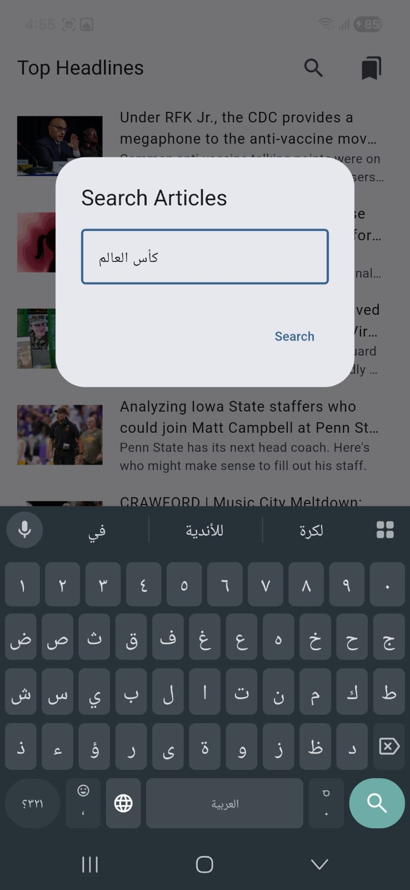
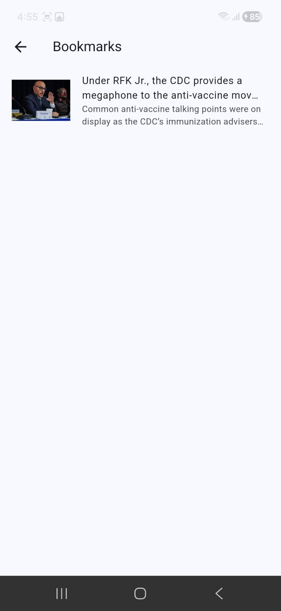
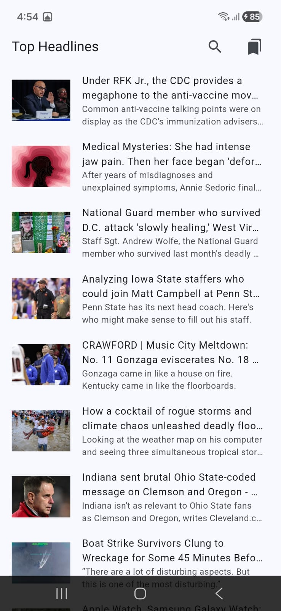

# News Reader App

A Flutter-based news reader application that displays top headlines and allows users to search for articles, bookmark their favorites, and read full article details.

## Features

- Browse top headlines from various sources
- Search for articles in multiple languages (supports Arabic)
- Bookmark articles for later reading
- View full article details with images

## Screenshots

  
  
  
  
  

### Getting Your API Key

1. Visit [NewsAPI.org](https://newsapi.org/)
2. Sign up for a free account
3. Get your API key from the dashboard
4. Add your NewsAPI key
    - API key add it to /lib/constants.dart

